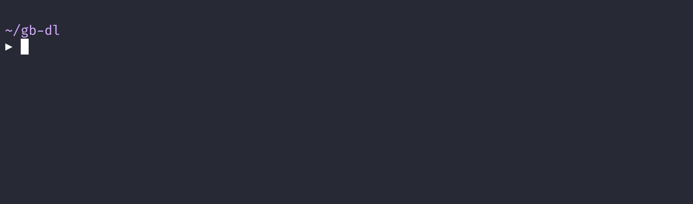

# gb-dl

## A CLI for downloading [Giant Bomb](https://www.giantbomb.com) videos.

## How to Use

### Binaries

[Visit the releases page](https://github.com/lightpohl/gb-dl/releases) and download the latest binary for your system.

`gb-dl --api-key <YOUR_API_KEY> --show-name <string> --video-name <string>`

`gb-dl --api-key <YOUR_API_KEY> --show-name "Giant Bombcast" --video-name "Giant Bombcast 607"`

`gb-dl --api-key <YOUR_API_KEY> --show-name "Giant Bombcast" --video-number 0`

`gb-dl --api-key <YOUR_API_KEY> --video-guid "2970-14405"`

### npx

**[Node Required](https://nodejs.org/en/)**

`npx gb-dl --api-key <YOUR_API_KEY> --show-name <string> --video-name <string>`

## Options

**API key may be provided via `--api-key` option or `GIANTBOMB_TOKEN` env variable.**

**Either `--video-name`, `--video-guid`, or `--video-number` must be provided.**

| Option                 | Type   | Required | Description                                                                                           |
| ---------------------- | ------ | -------- | ----------------------------------------------------------------------------------------------------- |
| --api-key              | String | false\*  | Individual [Giant Bomb API key](https://www.giantbomb.com/api/).                                      |
| --show-name            | String | false    | Used to find matching show title.                                                                     |
| --video-name           | String | false\*  | Used to find matching video title.                                                                    |
| --video-guid           | String | false\*  | Used to grab a video by its GUID directly.                                                            |
| --video-number         | Number | false\*  | Zero-based video index for provided show (most recent video is `0`). Defaults to `0`.                 |
| --video-number-reverse |        | false    | Swaps direction of provided "--video-number" (oldest video is now `0`).                               |
| --only-premium         |        | false    | Filter search to only premium videos.                                                                 |
| --only-free            |        | false    | Filter search to only free videos.                                                                    |
| --quality              | String | false    | Specify quality of video to download. Defaults to highest. Other options: hd, high, low and mobile.   |
| --date-after           | String | false    | Check if video was published after date before downloading (i.e. MM/DD/YYY, inclusive).               |
| --date-before          | String | false    | Check if video was published before date before downloading (i.e. MM/DD/YYY, inclusive).              |
| --out-dir              | String | false    | Specify output directory for video. Defaults to current working directory.                            |
| --add-guid-prefix      |        | false    | Prefixes the downloaded video with its associated GUID (e.g. "2300-14149 - Quick Look\_ Forager.mp4") |
| --add-date-prefix      |        | false    | Prefixes the downloaded video with its publish date (e.g. "2021-05-08 - Quick Look\_ Forager.mp4")    |
| --info                 |        | false    | Output video information instead of download.                                                         |
| --archive              |        | false    | Check archive before downloading.                                                                     |
| --blocklist            |        | false    | Check blocklist before downloading.                                                                   |
| --clean                |        | false    | Ignore cache when making query.                                                                       |
| --debug                |        | false    | Show debug statements.                                                                                |
| --version              |        | false    | Output the version number.                                                                            |
| --help                 |        | false    | Output usage information.                                                                             |

## [Giant Bomb API](https://www.giantbomb.com/api/)

- Make sure to stay within the [Giant Bomb API usage guidelines](https://www.giantbomb.com/api/).
- The Giant Bomb API has an account download limit of **100 videos per day.**

## Rate Limiting

- A one second delay between requests is added to avoid flooding the Giant Bomb API.
- `gb-dl` may need to make a few requests to find a video, so expect a short delay after starting.

## Caching

- `gb-dl` will generate a `gb-dl-cache.json` in the current working directory when run in order to avoid hitting the Giant Bomb API repeatedly for the same set of data.
- Cached responses will be used for one hour.
- Adding `--clean` to the command will bypass the cache.
- Expired cache results will be removed on script start.

## Archive

- If passed the `--archive` flag, `gb-dl` will generate/use a `gb-dl-archive.json` in the current working directory.
- Before downloading a video, it'll check if the video was downloaded previously and abort the download if found.

## Blocklist

- If the `--blocklist` flag is passed, `gb-dl` will lookup a `gb-dl-blocklist.json` in the current working directory.
- Before downloading a video it'll check if the `video_show` title is included in the blocklist and ignore the download if found.
- See [Examples](./examples) for an example blocklist.

## [More Examples](./examples)
